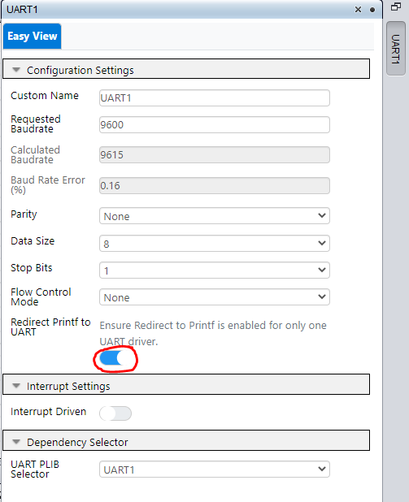
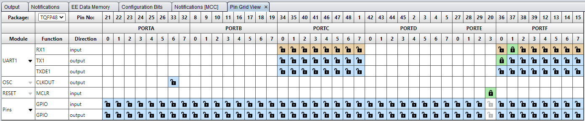
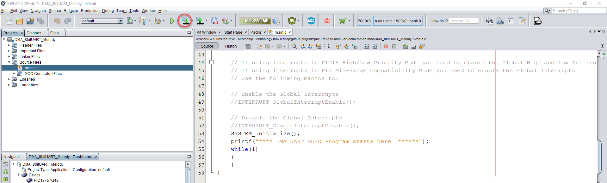
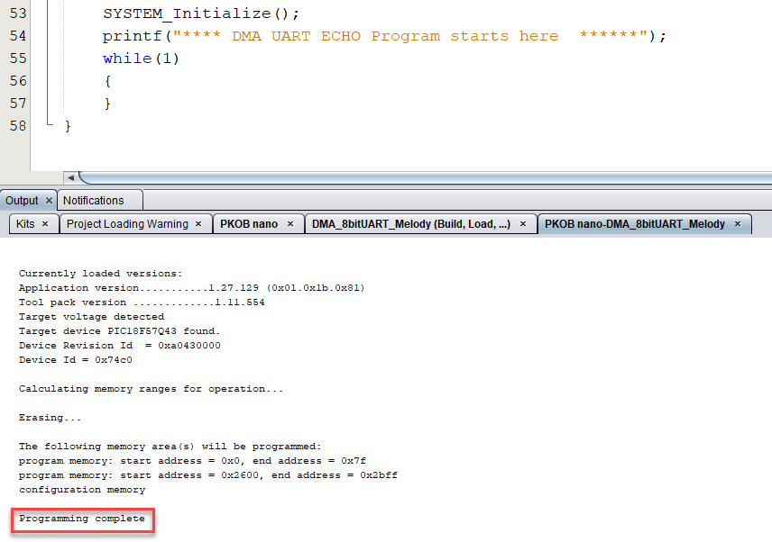
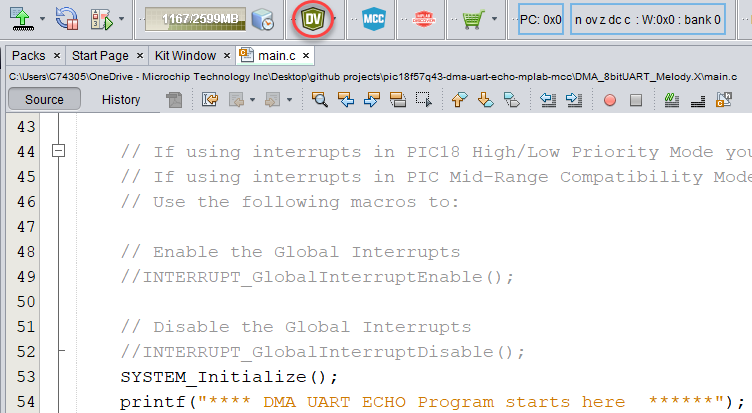

<!-- Please do not change this logo with link -->

# DMA UART ECHO for PIC18F57Q43 (or 8 bit devices)

1. This project showcases the efficiency of the Direct Memory Access (DMA) in customers' projects.
2. This example highlights the advantages of the DMA and how it can improve the project's performance.
3. The project uses an UART and DMA peripheral.

This project application can be used by any device using a DMA, and is suited for MCC Classic or Melody. The provided code is used by the PIC18F57Q43 Curiosity Nano board.

### Curiosity Nano Development Board:

## Related Documentation

- [MPLAB Code Configurator](https://www.microchip.com/en-us/development-tools-tools-and-software/embedded-software-center/mplab-code-configurator)

## Software Used

- MPLAB® X IDE 6.10.0 or newer [(MPLAB® X IDE 6.10)](https://www.microchip.com/en-us/development-tools-tools-and-software/mplab-x-ide?utm_source=GitHub&utm_medium=TextLink&utm_campaign=MCU8_MMTCha_MPAE_Examples&utm_content=pic18f57q43-dma-uart-echo-mplab-mcc-github)
- MPLAB® XC8 2.41.0 or newer compiler [(MPLAB® XC8 2.41)](https://www.microchip.com/en-us/development-tools-tools-and-software/mplab-xc-compilers?utm_source=GitHub&utm_medium=TextLink&utm_campaign=MCU8_MMTCha_MPAE_Examples&utm_content=pic18f57q43-dma-uart-echo-mplab-mcc-github)
- MPLAB® Code Configurator (MCC) 5.3.7 or newer [(microchip.com/mplab/mplab-code-configurator)](https://www.microchip.com/mplab/mplab-code-configurator)
- Microchip PIC18F-Q Series Device Support (1.18.389) or newer [(packs.download.microchip.com/)](https://packs.download.microchip.com/)
- MPLAB® Data Visualizer v1.3.1331 [MPLAB®  Data Visualizer v1.3.133](https://www.microchip.com/en-us/tools-resources/debug/mplab-data-visualizer)

## Hardware Used

- [PIC18F57Q43 CNANO Board](https://www.microchip.com/en-us/development-tool/DM164150)
- Micro-USB to USB 2.0 cable

## Setup

1. Connect the PIC18F57Q43 Curiosity Nano board to a PC using the Micro-USB to USB 2.0 cable. 

2. If not already on your system, download and install MPLABX IDE version 6.10 (or newer).
3. If not already on your system, download and install the XC8 C-Compiler version 2.41 (or newer).

## Operation
Complexity : Easy 

1. Open the desired project file "DMA_8bitUART_Classic" for MCC Classic setup or "DMA_8bitUART_Melody" for MCC Melody setup.

  ###### Figure 1: Open Project Window
  

2. Click **Project Properties** to open the Project Properties window. Select the Curiosity Nano device from the Hardware Tool drop-down menu, as shown in figure 2.

  ###### Figure 2: Select the Nano in Project Properties Window
  

3. Once the project is open, open MCC by clicking the blue "MCC" shield in the top toolbar. Select the UART peripheral in Project Resources under Drivers and enable the "Redirect Prtinf to UART" option as shown in figure 3.

  ###### Figure 3: 'Redirect Printf to UART' Check-box
  

4. Select the DMA peripheral in Project Resources under Drivers. The DMA module is configured to transfer data from the UART1RX to UART1TX without help from the CPU. The settings for the DMA are provided in figure 4 and 5.

  ###### Figure 4: 'DMA  settings' 
  

The Source Message Size can be configured to more than 1 byte. For this project it is set to 1 byte. Select the DMA1(PLIB) from the Builder graph. Configure the DMA1 settings according to figure 5.

  ###### Figure 5: 'DMA1 PLIB settings' 
  

When configuring a DMA channel, you can choose the address mode for the source and destination addresses. The options are:

- Unchanged: The address remains the same throughout the transfer.
- Increment: The address is incremented after each transfer.
- Decrement: The address is decremented after each transfer.

These options determine how the DMA controller updates the source and destination addresses during the transfer. The choice of address mode depends on the specific requirements of the application. For this example project we will go with unchanged address mode.

The DMA Destination Message Size for UART peripheral must be set to 1 Byte as it can only display 1 Byte at a time. More information about customizing the DMA can be found here (https://www.microchip.com/en-us/products/microcontrollers-and-microprocessors/8-bit-mcus/core-independent-and-analog-peripherals/system-flexibility/direct-memory-access)  

5. Select the "Pin Grid View" window and configure the I/O pins as shown in the figure 6. This connects the UART TX and RX ports of the MCU to the CDC TX and RX ports. By doing this, we can send UART messages via the COM port through the USB. 
  ###### Figure 6: 'IO Pin Configuration'
  

6. Click "Make and Program Device" in the top ribbon to program the Curiosity Nano, as shown in figure 7. Verify that the device was successfully programmed, as shown in figure 8.

  ###### Figure 7: 'Make and Program Device' Button
  

  ###### Figure 8: Program Complete
  

7. For this example, **Data Visualizer** was used as the terminal program.
  ###### Figure 9: Open Data Visualizer
     

8. Select the port that is used by the Nano board as shown in figure 10. 

  ###### Figure 10: Select the USB Port
  
  
9. Configure the serial port, as shown in figure 11. 
  ###### Figure 11: Configure the Serial Port
  

After the Nano board is programmed, the UART module will transmit the string "**** **DMA UART ECHO Program starts here**  ******".

## Summary
The 'DMA_8bitUART_Melody' and the 'DMA_8bitUART_Classic' code example uses the PIC18F57Q43 Curiosity Nano Development board to demonstrate how to setup a DMA using MCC. The example shows the efficiency and usefulness of DMA in an application and can be used to prevent the usuage of CPU.

The terminal (see figure 12.) shows the output echo, **the light font being input** from customer and **the bold font being output** from the DMA. The input is passed from UART_RX port to the UART_TX port using the UART trigger, but not the CPU.

###### Figure 12: Output of echo
