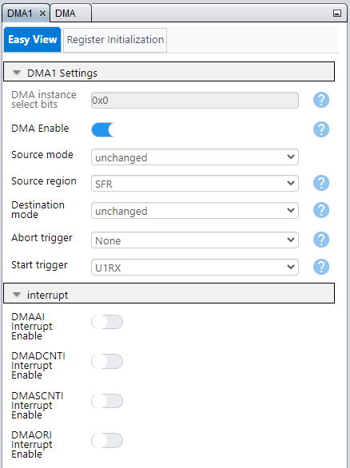

<!-- Please do not change this logo with link -->

# DMA UART ECHO for PIC8 bit devices

This project aims to showcase the efficiency and usefulness of Direct Memory Access (DMA) in customers' projects. By utilizing the Microchip Code Configurator (MCC), setting up DMA becomes a hassle-free process. The demonstration will highlight the advantages of DMA and how it can improve the performance of the project. 

This project application can be applicable for any device with DMA and is suited for MCC Classic or Melody. The code provided is run on PIC18F57Q43 CNANO board.

### Curiosity Nano Development Board:

## Related Documentation

- [MPLAB Code Configurator](https://www.microchip.com/en-us/development-tools-tools-and-software/embedded-software-center/mplab-code-configurator)

## Software Used

- MPLAB® X IDE 6.10.0 or newer [(MPLAB® X IDE 6.10)](https://www.microchip.com/en-us/development-tools-tools-and-software/mplab-x-ide?utm_source=GitHub&utm_medium=TextLink&utm_campaign=MCU8_MMTCha_MPAE_Examples&utm_content=pic18f57q43-dma-uart-echo-mplab-mcc-github)
- MPLAB® XC8 2.41.0 or newer compiler [(MPLAB® XC8 2.41)](https://www.microchip.com/en-us/development-tools-tools-and-software/mplab-xc-compilers?utm_source=GitHub&utm_medium=TextLink&utm_campaign=MCU8_MMTCha_MPAE_Examples&utm_content=pic18f57q43-dma-uart-echo-mplab-mcc-github)
- MPLAB® Code Configurator (MCC) 5.3.7 or newer [(microchip.com/mplab/mplab-code-configurator)](https://www.microchip.com/mplab/mplab-code-configurator)
- Microchip PIC18F-Q Series Device Support (1.18.389) or newer [(packs.download.microchip.com/)](https://packs.download.microchip.com/)
- MPLAB® Data Visualizer v1.3.1331 [MPLAB®  Data Visualizer v1.3.133](https://www.microchip.com/en-us/tools-resources/debug/mplab-data-visualizer)

## Hardware Used

- [PIC18F57Q43 CNANO Board](https://www.microchip.com/en-us/development-tool/DM164150)
- Micro-USB to USB 2.0 cable

## Setup

1. Connect the PIC18F57Q43 Curiosity Nano board to a PC using the Micro-USB to USB 2.0 cable.
2. If not already on your system, download and install MPLABX IDE version 6.10 (or newer).
3. If not already on your system, download and install the XC8 C-Compiler version 2.41 (or newer).
4. Open the desired project file "DMA_8bitUART_Class" for MCC Classic setup or "DMA_8bitUART_Melody" for MCC Melody setup.

  ###### Figure 1: Open Project Window
  

5. Click -> **Project Properties** button to open the Project Properties window. Select the Curiosity tool from the Tools drop-down menu as shown in Figure 2.

  ###### Figure 2: Select the Nano in Project Properties Window
  

6. Press the 'Make and Program Device' button to program the PIC (see Figure 3). Verify that the device was successfully programmed (see Figure 4).

  ###### Figure 3: 'Make and Program Device' Button
  

  ###### Figure 4: Program Complete
  

7. For this example, Data Visualizer was used as the terminal program.
  ###### Figure 5: Open Data Visualizer
     
  a. Select the port that is used by the Nano board as shown in Figure 5.  
  b. Configure the serial port as shown in Figure 6.  
  ###### Figure 6: Select the USB Port
  

  ###### Figure 7: Configure the Serial Port
  

## Operation
After the Nano board is programmed, the EUSART module will transmit the string "**** DMA UART ECHO Program starts here  ******".

The EUSART module is configured to use the `printf()` function call that it built in to the XC8 libraries. In MCC, check the 'Redirect Printf to USART' check-box as shown in Figure 8, and the additional function calls are added to the project. 

  ###### Figure 8: 'Redirect Printf to USART' Check-box
  

The DMA module is configured to transfer the data from UART1RX to UART1TX without the help of the CPU. The settings for the DMA are provided in Figure 9 and 10.

  ###### Figure 9: 'DMA source settings' 
  

Note: the Source Message Size can be configured to more than 1 byte. For this project is is set to 1 Byte.

  ###### Figure 10: 'DMA destination settings' 
  

The DMA Destination Message Size for UART peripheral should be set to 1 Byte as it can only display one Byte at a time. More information about customizing the DMA can be found here (link)  
## Summary
The 'DMA_8bitUART_Melody' and the 'DMA_8bitUART_Classic' code example uses the PIC18F57Q43 Curiosity Nano Development board to demonstrate how to setup a DMA using MCC. The example shows the efficiency and usefulness of DMA in an application and can be used to prevent the usuage of CPU.

###### Figure 11: Output of echo
