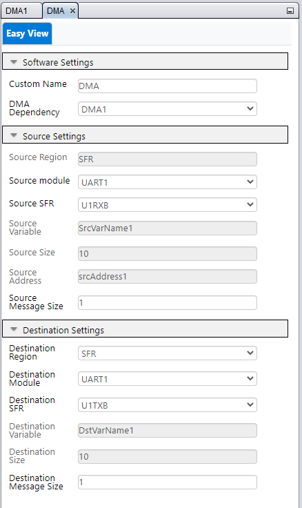

<!-- Please do not change this logo with link -->

# DMA UART ECHO for PIC18F57Q43 (or 8 bit devices)

1. This project showcases the efficiency of the Direct Memory Access (DMA) in customers' projects.
2. This example highlights the advantages of the DMA and how it can improve the project's performance.
3. The project uses an UART and DMA peripheral.

This project application can be used by any device using a DMA, and is suited for MCC Classic or Melody. The provided code is used by the PIC18F57Q43 Curiosity Nano board.

### Curiosity Nano Development Board:

## Related Documentation

- [MPLAB Code Configurator](https://www.microchip.com/en-us/development-tools-tools-and-software/embedded-software-center/mplab-code-configurator)

## Software Used

- MPLAB® X IDE 6.10.0 or newer [(MPLAB® X IDE 6.10)](https://www.microchip.com/en-us/development-tools-tools-and-software/mplab-x-ide?utm_source=GitHub&utm_medium=TextLink&utm_campaign=MCU8_MMTCha_MPAE_Examples&utm_content=pic18f57q43-dma-uart-echo-mplab-mcc-github)
- MPLAB® XC8 2.41.0 or newer compiler [(MPLAB® XC8 2.41)](https://www.microchip.com/en-us/development-tools-tools-and-software/mplab-xc-compilers?utm_source=GitHub&utm_medium=TextLink&utm_campaign=MCU8_MMTCha_MPAE_Examples&utm_content=pic18f57q43-dma-uart-echo-mplab-mcc-github)
- MPLAB® Code Configurator (MCC) 5.3.7 or newer [(microchip.com/mplab/mplab-code-configurator)](https://www.microchip.com/mplab/mplab-code-configurator)
- Microchip PIC18F-Q Series Device Support (1.18.389) or newer [(packs.download.microchip.com/)](https://packs.download.microchip.com/)
- MPLAB® Data Visualizer v1.3.1331 [MPLAB®  Data Visualizer v1.3.133](https://www.microchip.com/en-us/tools-resources/debug/mplab-data-visualizer)

## Hardware Used

- [PIC18F57Q43 CNANO Board](https://www.microchip.com/en-us/development-tool/DM164150)
- Micro-USB to USB 2.0 cable

## Setup

1. Connect the PIC18F57Q43 Curiosity Nano board to a PC using the Micro-USB to USB 2.0 cable. 
  ###### Figure 1: PIC18F57Q43 USB connection
  

2. If not already on your system, download and install MPLABX IDE version 6.10 (or newer).
3. If not already on your system, download and install the XC8 C-Compiler version 2.41 (or newer).

## Operation
Complexity : Easy 

1. Open the desired project file "DMA_8bitUART_Classic" for MCC Classic setup or "DMA_8bitUART_Melody" for MCC Melody setup.

  ###### Figure 2: Open Project Window
  

2. Click **Project Properties** to open the Project Properties window. Select the Curiosity Nano device from the Hardware Tool drop-down menu, as shown in figure 3.

  ###### Figure 3: Select the Nano in Project Properties Window
  

3. Once the project is open, Click on MCC. In the UART peripheral. Check the 'Redirect Printf to USART' check-box, as shown in figure 4,

  ###### Figure 4: 'Redirect Printf to USART' Check-box
  

4. Select the DMA Peripheral under Project Resources, Drivers. The DMA module is configured to transfer the data from UART1RX to UART1TX without the help of the CPU. The settings for the DMA are provided in figure 5 and 6.

  ###### Figure 5: 'DMA source settings' 
  

Note: the Source Message Size can be configured to more than 1 byte. For this project is set to 1 Byte.

  ###### Figure 6: 'DMA destination settings' 
  

The DMA Destination Message Size for UART peripheral must be set to 1 Byte as it can only display one Byte at a time. More information about customizing the DMA can be found here (https://www.microchip.com/en-us/products/microcontrollers-and-microprocessors/8-bit-mcus/core-independent-and-analog-peripherals/system-flexibility/direct-memory-access)  

5. Click **Make and Program Device** to program the PIC, as shown in figure 7. Verify that the device was successfully programmed, as shown in figure 8.

  ###### Figure 7: 'Make and Program Device' Button
  

  ###### Figure 8: Program Complete
  

6. For this example, Data Visualizer was used as the terminal program.
  ###### Figure 9: Open Data Visualizer
     
7. Select the port that is used by the Nano board as shown in figure 10.  

  ###### Figure 10: Select the USB Port
  
8. Configure the serial port, as shown in figure 11.  
  ###### Figure 11: Configure the Serial Port
  

After the Nano board is programmed, the EUSART module will transmit the string "**** DMA UART ECHO Program starts here  ******".

## Summary
The 'DMA_8bitUART_Melody' and the 'DMA_8bitUART_Classic' code example uses the PIC18F57Q43 Curiosity Nano Development board to demonstrate how to setup a DMA using MCC. The example shows the efficiency and usefulness of DMA in an application and can be used to prevent the usuage of CPU.

The terminal (see figure 11.) shows the output echo, the light font being input from customer and the bold font being output from the DMA. The input is passed from UART_RX port to the UART_TX port without using CPU.

###### Figure 12: Output of echo
